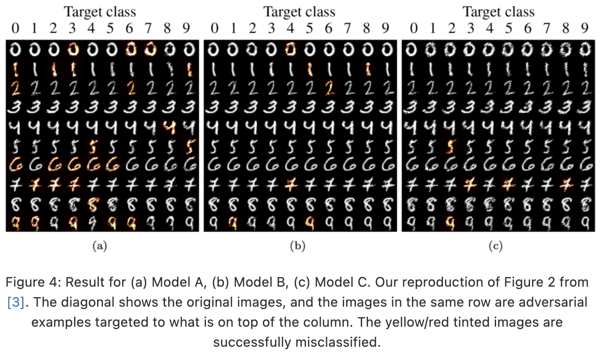
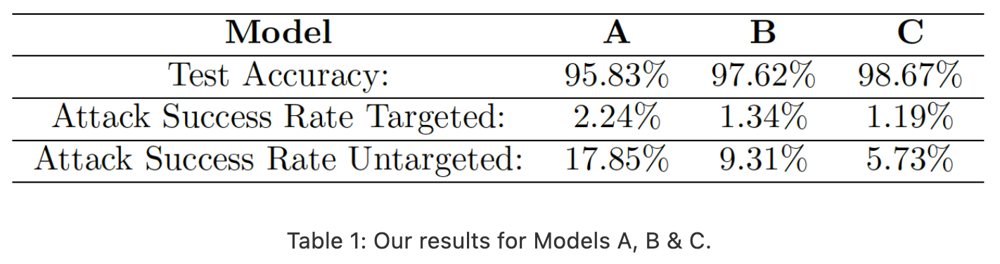

# Spatially Transformed Adversarial Examples (stAdv) Reproduction

This project aims to reproduce the paper [Spatially Transformed Adversarial Examples](https://arxiv.org/abs/1801.02612) (Xiao, C., Zhu, J., Li, B., He, W., Liu, M., & Song, D.),
where they introduce a new method for attacking deep neural networks so that they misclassify adversarial examples.

Our blog can be found [here](https://hackmd.io/0AgywzjYTU6I0pagAt3a0g), or a PDF version can be seen in [`Blog_reproduction_stAdv.pdf`](Blog_reproduction_stAdv.pdf).

The goal was to reproduce the table 1 of the original paper and figure 2, which can be seen below.





## Requirements

To install the required packages, run the following command:

```bash
pip install -r requirements.txt
```

## Usage

All of our code for implementing stAdv is located in the Jupyter Notebook `stAdv.ipynb`. To run the notebook, you need to have [Jupyter Notebook](https://jupyter.org/install) installed.

## Folders and files

`Figures` folder contains the figures used in our blog

`SGD_models` folder contains the notebooks written for training the models A, B, and C from scratch.

`adv_tests` folder contains the adversarial test sets of model A, B, and C. They contain the 10.000 adversarial images with random targets used to evaluate the attack success rates.
